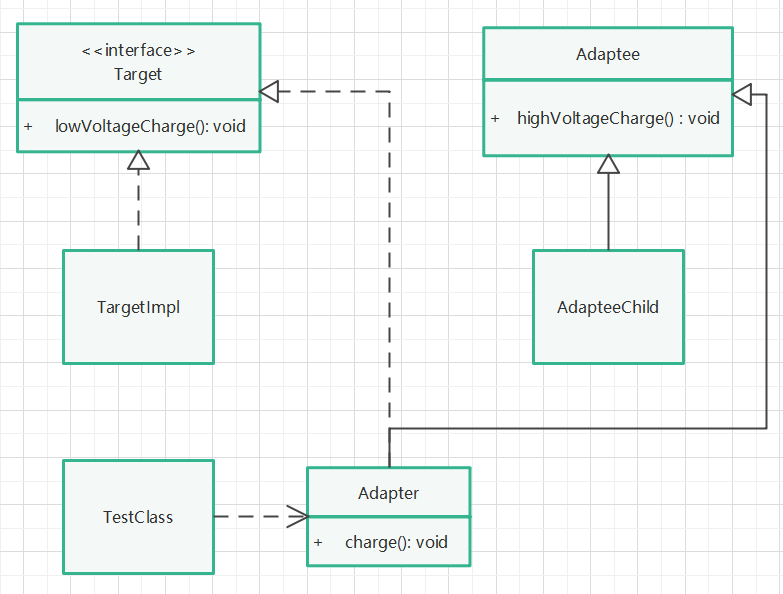

# 适配器模式

## 定义

适配器模式将某个类的接口转换成客户端期望的另一个接口表示，目的是消除由于接口不匹配所造成的类的兼容性问题。

## 针对问题

有两个正常工作的接口或类，但是它们之间的方法不兼容，不能一起工作，因此需要一个适配者，将两者进行适配。

## 模式分类

1. 类适配器：继承源类，实现目标接口。
2. 对象适配器：实现目标接口，使用源类的对象（关联关系）。

## 模式区别

1. 类适配器：代码简单，但耦合度高。
2. 对象适配器：代码复杂，但耦合度低。

## 实现步骤

1. 创建两个正常工作的接口或抽象类，分别实现或继承。
2. 创建适配者，如果使用类适配，则继承抽象类并实现目标接口；如果使用对象适配，则实现目标接口，使用源类的对象。

## 类说明

1. Adapter为类适配器
2. Adapter1为对象适配器

## UML类图

