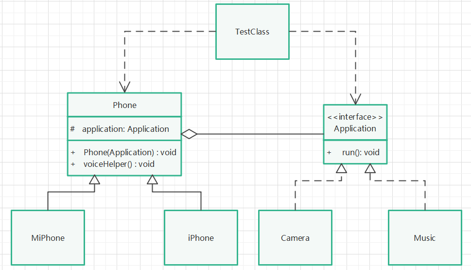

# 桥接模式

## 定义

将抽象和实现解耦，使得两者可以独立地变化。

## 针对问题

桥接模式是为了解决类的继承缺点而设计的，当一个类想拥有另一个类或接口的某些方法时，可以不用继承或实现某个类或接口，只需搭建一个桥梁（抽象类）即可。  
一般在接口或抽象类不稳定的情况下，或不希望使用继承的场景下使用桥接模式。

## 实现步骤

1. 这里使用举例的方式演示，介绍：手机类（抽象类）需要某些应用程序（实现类），但是手机和应用程序又是两个维度的东西，不想相互继承，且需分开变化。
2. 创建应用程序接口，包含一个run()方法。
3. 为应用程序接口创建两个具体实现类，相机类和音乐类，并实现具体的run()方法。
4. 创建一个手机抽象类，聚合应用程序接口对象，并用构造方法对该对象进行初始化。
5. 手机类提供一些抽象方法做其他事（可以省略，主要是演示用）。
6. 为手机类创建两个具体实现类，在具体实现类中，可以重写其父类的抽象方法，或定义自己的方法调用应用程序接口提供的方法。
7. 实现了手机类没有继承应用程序类，但可以调用应用程序提供的方法，同时，手机类和应用程序接口可以分开单独变化而不互相影响。

## UML类图

