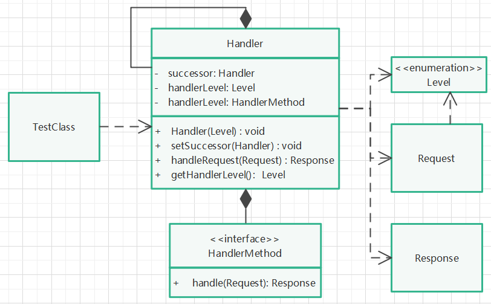

# 责任链模式

## 定义

使多个对象都有机会处理请求，从而避免了请求的发送者和接受者之间的耦合关系。将这些对象连成一条链，并沿着这条链传递该请求，直到有对象处理它为止。

## 针对问题

责任链上的处理者负责处理请求，客户只需要将请求发送到责任链上即可，无须关心请求的处理细节和请求的传递，所以责任链将请求的发送者和请求的处理者解耦了。

## 实现步骤

1. 创建等级枚举类（Level），用于划分请求等级和处理者等级。
2. 创建请求类（Request），用于统一请求方式，包含获取请求等级的方法。
3. 创建响应类（Response），用于统一响应格式。
4. 创建责任链对象类（Handler）,聚合本类对象，关联处理等级、处理方法接口实现对象。提供设置下一个处理者（责任链对象）方法、处理请求方法（等级匹配判断和默认处理）。
5. 创建处理方法接口（HandlerMethod）,提供处理方法。
6. 创建具体处理类，继承责任链对象类，实现处理方法接口。（具体原因看注意事项2）
7. 创建具体责任链对象，设置责任链关系，调用责任链对象类提供的处理请求方法。

## 注意

1. 原则上，责任链对象类只应提供一个唯的处理请求方法handleRequest(Request request)，该方法负责处理等级匹配与请求处理方法调用。
2. 为什么不在Handler类中提供handle处理方法，而是通过接口的方式（解答实现步骤6）：因为java的protected关键字或默认的default关键字限定的方法，其不仅可以在子类中重写，还能在本包内使用，即具体处理类对象也会包含该方法，因此，如果具体处理类调用了handle方法，则跳过了其父类唯一提供的handleRequest方法，没有实现等级匹配则直接调用，容易产生不可预期的结果。因此，将方法独立成接口，具体处理类需要实现该接口。
3. 因上述2的原因，在Handler中，需要聚合HandlerMethod接口对象，在其构造方法中，需要初始化（强转）该接口对象。
4. 具体责任链对象类不仅需要继承Handler类，还要实现HandlerMethod接口，否则不能正常处理请求。
5. **不能出现首尾相连（泛指）**，否则出现死循环造成系统错误。

## 优缺点

1. 优点：请求和处理解耦。
2. 缺点：性能问题，如果责任链太长，需要依次判断处理等级，每个请求都是从责任链开端传递到末端。调试复杂。

## UML类图

