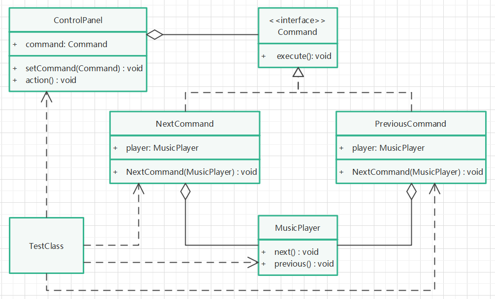

# 命令模式

## 定义

将一个请求封装为一个对象，使发出请求的任务和执行请求的任务分割开。这样两者之间通过命令对象进行沟通，这样方便将命令对象进行储存、传递、调用、增加与管理。

## 针对问题

需要对发送请求体和实现请求体解耦时，或是希望对请求进行记录、撤销、重做、排队等操作时，可以使用命令模式。

## 实现步骤

1. 创建命令接收类Receiver（MusicPlayer）,提供一些基础操作方法。
2. 创建命令接口（Command），提供命令执行方法execute()。
3. 为命令接口提供实现类，聚合接收类对象，实现命令执行方法execute()。
4. 创建命令调用者类Invoker（CommandPanel），聚合命令对象，提供设置命令方法和调用方法。
5. 创建命令接收者对象，创建命令对象并设置接收者，创建命令调用者对象，用该对象调用命令。

## 解析

1. 为什么需要有命令调用类：因为需要命令执行者和调用者解耦，符合单一职责原则。举例来说：音乐播放器是执行者，提供基础的切歌功能，而调用者是其对应的遥控器。试想如果没有遥控器，用户则需要知道遥控器的调制解调功能，命令格式等才能控制播放器。
2. 已经创建了命令接收者和命令，为什么不直接调用命令的执行功能：结合上一条解析，假如遥控器需要对命令进行调制解调，明码命令不能直接执行，那么就需要在遥控器内部进行编码解码，如果直接执行命令，则命令可能不被执行对象认可。

## 优缺点

1. 优点：调用者和执行者解耦，可单独变化，职责单一，便于扩展，体现封装性。
2. 缺点：命令较多时可能造成类的膨胀，代码较多。

## UML类图

