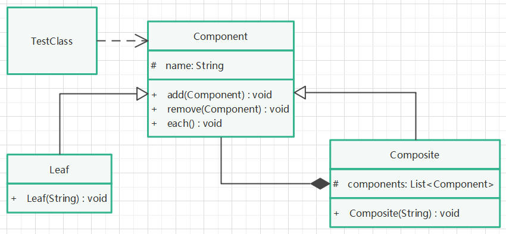

# 组合模式

## 定义

将对象组合成树形结构以表示“部分-整体”的层次结构。组合模式使得用户对单个对象和组合对象的使用具有一致性。

## 针对问题

当发现需求中是体现部分与整体层次结构时，以及你希望用户可以忽略组合对象与单个对象的不同，统一地使用组合结构中的所有对象时，就应该考虑组合模式了。

## 实现步骤

1. 创建一个部分与整体的公共父类或接口，定义其需要提供的公共方法。
2. 创建部分类，继承或实现上述父类或接口。在部分类中，以部分类的视角，对公共方法重写或实现。
3. 创建整体类，继承或实现上述父类或接口。在整体类中，组合父类或接口的对象集合，以整体类的视角，对公共方法重写或实现。
4. 创建部分类对象和整体类对象，在整体类对象中，可以添加部分类。使用父类或接口提供的方法，操作部分对象或整体对象。

## UML类图

