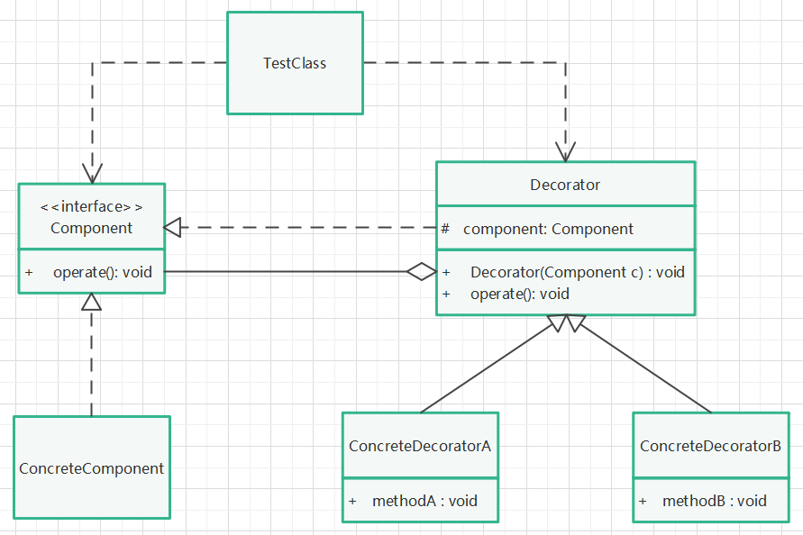

# 装饰模式

## 定义

动态的给一个对象添加一些额外的职责。就增加功能来说，装饰模式相比生成子类更为灵活。

## 针对问题

需要给某个对象添加额外的功能，而又不想改变原有对象的类。

## 实现步骤

1. 创建一个原有对象类（或接口），实现某些原有功能。
2. 创建一个装饰类，继承（或实现）原有对象类，然后将原有对象作为其属性，通过构造方法实例化，并且有一些额外的功能。
3. 在装饰类中，重写原有对象类的方法，并在其中调用（增加）额外的功能。
4. 实例化装饰类，并调用被装饰过的方法，实现功能增强。

## UML类图

