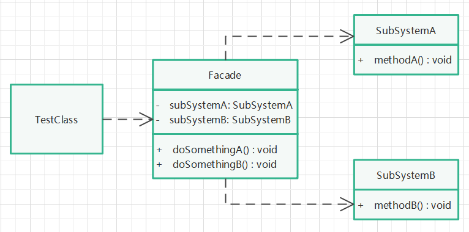

# 外观模式

## 定义

隐藏了系统的复杂性，并向客户端提供了一个可以访问系统的接口。

## 针对问题

子系统使用很复杂，客户想简化使用子系统，那么把一些复杂的流程封装成一个接口供给外部用户更简单的使用。

## 实现步骤

1. 创建两个子系统类A和B，实现某些复杂的功能。
2. 创建一个门面类，提供一些简单的方法，实现对A和B的复杂功能调用。
3. 对门面类进行实例化，使用其提供的简单方法，从而实现对复杂子系统A和B的调用。

## 优缺点

1. 优点：简化调用、降低耦合、分层控制、迪米特法则（最少知道原则）。
2. 缺点：子系统扩展容易产生风险、不符合开闭原则（子系统扩展时，门面类需要做对应修改）。

## UML类图

