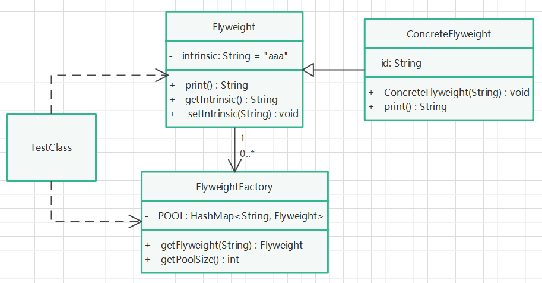

# 享元模式

## 定义

使用共享对象（元素）可有效地支持大量的细粒度的对象。

## 针对问题

在项目中，需要用到大量的某一类型的对象，且这些对象包含某写固定的特征（外部特征，如：ID），如果通过创建对象的方式来重复创建这些对象，那么很可能造成内存溢出现象。因此用池的概念对有重复特征的对象加以管理，可避免重复创建类似（内部特征可变）的对象，减少内存溢出风险。

## 实现步骤

1. 将一个类的属性进行划分，一部分为具有同一特征的属性（外部状态），另一部分为具有不同特诊的属性（内部状态）。
2. 创建一个抽象类（Flyweight），内部状态作为其属性，内部状态一般是可变的，提供变更方法。
3. 为上述抽象类创建具体实现类，外部状态作为其属性，因其外部状态应具有稳定性，因此不提供变更方法。
4. 创建一个享元工厂类，在类中维护一个HashMap池，一般将外部状态作为Map的Key，该工厂需要提供一个返回和创建享元对象的方法。
5. 通过享元工厂对象，根据外部状态的不同，获取或创建具体享元类的对象。

## 提醒

1. 为了便于理解，可以参考Java中的String对象的原理。
2. 也可以理解为不重复创建相同的对象，使用Hash算法管理对象（池概念）。
3. ***注意***：在多线程的情况下，共享同一对象需要注意线程安全问题。
4. ***注意***：外部状态应该具有稳定性（作为key），不应该随内部状态的变化而变化，因此不应该提供修改外部状态的方法。

## UML类图

