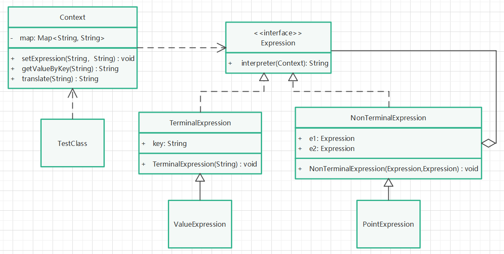

# 解释器模式

## 定义

给定一个语言，定义它的文法得一种表示，并定义一个解释器，这个解释器使用该表示来解释语言中的句子。

## 针对问题

需要自定义一些描述语言并得到解释的场景下使用。比如：工作流的解释，通过自定义工作流图，根据工作节点类型，节点间的关系，解释程序应该怎样运行。

## 实现步骤

1. 创建上下文环境类Context，维护一些公共信息，如当前环境下某个符号代表什么含义，或提供一些公有操作方法等。
2. 创建表达式接口，提供解释方法。
3. 为上述接口提供两种不同的实现抽象类，分别是端点表达式抽象类和非端点表达式抽象类。端点表达式抽象类可看作叶子节点，存放一些值，非端点表达式抽象类用于链接多个端点表达式并指定之间的关系。
4. 为上述两个抽象类分别创建子类，实现父类接口方法。
5. 创建环境对象，设置当前环境下的一些语义文法等信息。
6. 调用环境对象提供的解释方法，实现某些语法在当前环境下的解释工作。

## 优缺点

1. 优点：能够自定义文法，比较灵活。
2. 缺点：实现复杂，执行效率低，逻辑复杂。现代编程环境中，除特殊需求外，很少使用。

## UML类图

