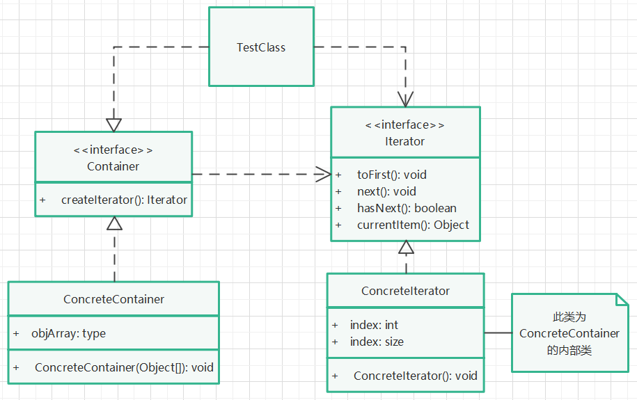

# 黑箱迭代子模式

## 实现步骤

1. 创建一种新的容器接口，提供获取迭代器的方法（正常项目中，还应提供更改容器内容的方法）。
2. 创建迭代器接口，提供重置游标位置、移动游标位置、判断游标是否到底、获取当前游标对象等方法。
3. 创建容器接口实现类，在其内部创建实现迭代器接口的实现类（体现黑箱），分别实现各自的方法。
4. 创建容器对象，获取迭代器对象，使用迭代器提供的方法，遍历容器对象。

## UML类图

