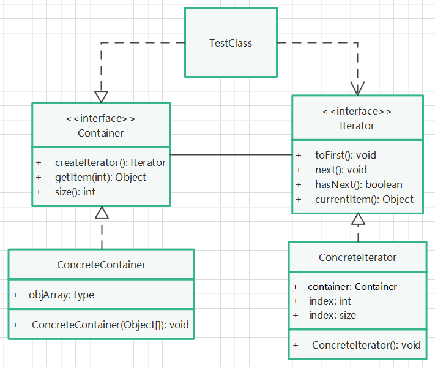

# 白箱迭代子模式

## 实现步骤

1. 创建一种新的容器接口，提供获取迭代器、获取容器大小、获取当前游标指向对象的方法（正常项目中，还应提供更改容器内容的方法）。
2. 创建迭代器接口，提供重置游标位置、移动游标位置、判断游标是否到底、获取当前游标对象等方法。
3. 创建容器接口实现类，注意在实现获取迭代器的方法中，将对象本身传递给迭代器实现类的构造方法（体现白箱）。
4. 创建迭代器接口实现类，通过其构造方法，初始化内部属性（如容器对象、游标位置、容器大小等）。
5. 创建容器对象，获取迭代器对象，使用迭代器提供的方法，遍历容器对象。

## UML类图

