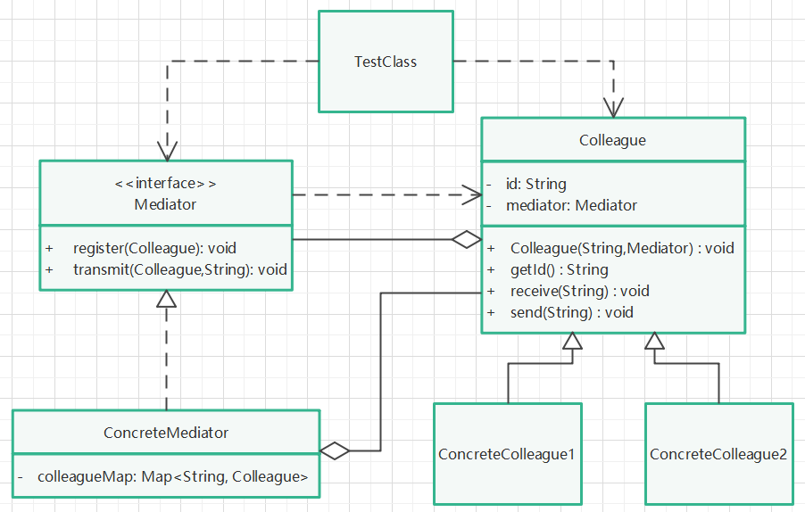

# 中介者模式

## 定义

中介者又叫做调停模式，是一种对象行为型模式，它降低了对象之间的耦合性，让对象易于被独立地调用，是迪米特法则（最少知道）的典型应用。

## 针对问题

类似于服务器转发两个客户端之间的消息场景，为了降低两个客户端之间的耦合性。试想，如果两个客户端需要发送消息，都需要直接调用对方提供的接收方法，那么耦合性就很高了，使用中介模式，可以降低耦合性。

## 实现步骤

1. 创建中介者接口Mediator，提供注册方法和转发方法。
2. 创建抽象同事类Colleague，提供接收和发送消息的方法，同时提供设置中介者的方法（注意：需要设置同一中介者，不同中介者维护的同事注册列表不一致）。
3. 为抽象同事类创建具体同事类ConcreteColleague1、ConcreteColleague2，实现父类的抽象方法。
4. 创建中介者对象，创建具体同事类对象，为具体同事类设置中介者对象，在中介者对象中注册同事对象，相互发送消息。

## 优缺点

1. 优点：避免同事类之间的过度耦合。
2. 缺点：同事类过多时，需要维护的注册列表信息会急剧膨胀，影响性能。

## UML类图

