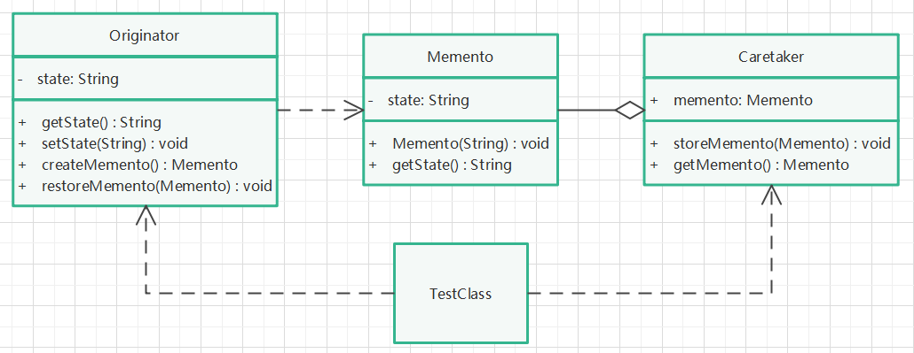

# 备忘录模式

## 定义

在不破坏封装的前提下，捕获一个对象的内部状态，并在对象之外保存这个状态。

## 针对问题

需要保存一类对象某一时刻的状态，以便以后恢复或记录使用时，可以使用备忘录模式。

## 实现步骤

1. 创建发起人类（Originator），包含需要保存的状态信息，提供创建备忘录和根据备忘录恢复状态的方法。
2. 创建备忘录类（Memento），包含被保存的状态信息。
3. 创建管理者类（Caretaker），维护被存储的备忘录实例，提供获取备忘录实例和设置备忘录实例的方法。
4. 创建发起人实例，设置状态，创建管理者对象，存储发起人当前状态，改变状态后又根据备忘录恢复状态，观察输出。

## 优缺点

1. 优点：不破坏被存储类的封装性，将内部状态进行外部存储。
2. 缺点：存储较大对象时，比较耗费硬件资源。

## UML类图

