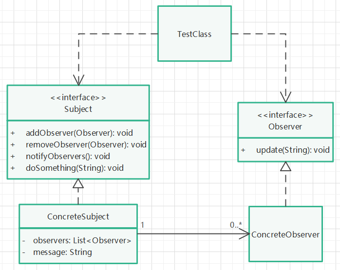

# 观察者模式

## 定义

定义对象间一种一对多的依赖关系，使得每当一个对象改变状态，则所有依赖于它的对象都会得到通知并被自动更新。

## 针对问题

一个对象发生改变，需要通知其他与之关联的对象做出反应，又不想一个个挑选是哪些对象与之关联，此时应使用观察者模式。此模式提供一个主题，订阅了该主题的对象，当主题发生变更时，都会收到通知。

## 实现步骤

1. 创建一个主题接口，提供添加、删除、通知订阅者和变更主题内容的方法。
2. 创建订阅者接口，提供接受通知的方法。
3. 实现主题接口，在该实现类中，维护一个订阅者集合，实现接口方法。在变更主题内容后，需调用通知订阅者方法。
4. 实现订阅者接口。
5. 创建主题对象，为其添加订阅者对象，变更主题内容，观察订阅者的响应。

## 优缺点

1. 优点：代码耦合度低，同时可以建立一套完善的通知机制。
2. 缺点：如果观察者较多，则通知时间会拉长。编写代码时，如果出现循环依赖（如观察者通知本类观察者，主题通知本类主题等），会导致循环通知，造成系统崩溃。

## UML类图

