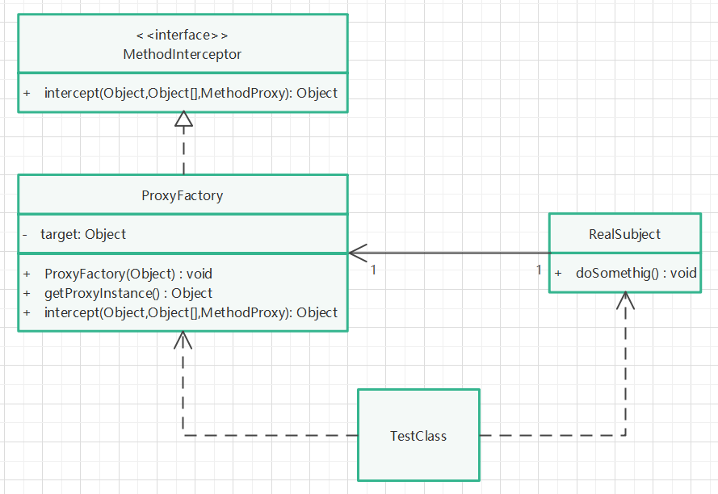

# CGLib代理模式

## 实现步骤

1. 创建一个被代理类，包含某一方法。
2. 创建代理工厂类，实现MethodInterceptor接口，被代理对象作为其属性，该对象在构造函数中被初始化（传参初始化，体现动态代理的灵活性）。
3. 在该代理工厂类中，需要有一个获取代理对象的方法，方法中需要设置代理对象的父类（用于cglib创建被代理对象的子类），设置回调函数，返回代理对象。
4. 同时，在该代理工厂类中，需要重写MethodInterceptor接口的intercept拦截方法，在该方法中调用被代理对象的某一方法，并在调用被代理对象方法前后，可以做一些其他操作。
5. 通过代理工厂类提供的获取代理对象方法，创建代理对象，并调用代理对象的某一方法。

## UML类图

