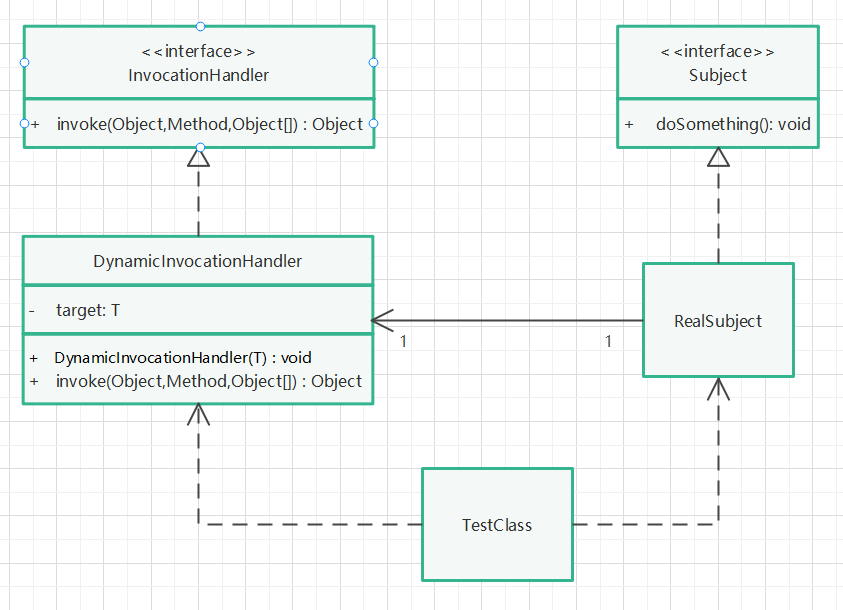

# 动态代理模式（JDK）

## 实现步骤

1. 创建一个被代理类的接口，拥有某一方法。
2. 创建一个被代理类，实现上述接口，实现某一方法。
3. 创建一个动态调用处理类，实现InvocationHandler接口，并聚合上述被代理类对象，该对象在构造函数中被初始化（传参初始化，体现动态代理的灵活性）。
4. 在动态调用处理类中，重写InvocationHandler接口的invoke方法，在方法中回调被代理对象的某一方法，在此期间，可以做一些其他操作。
5. 创建被代理对象，并将该对象传入动态调用处理类。
6. 通过Proxy类，动态创建代理对象，调用代理对象的某一方法。

## UML类图

