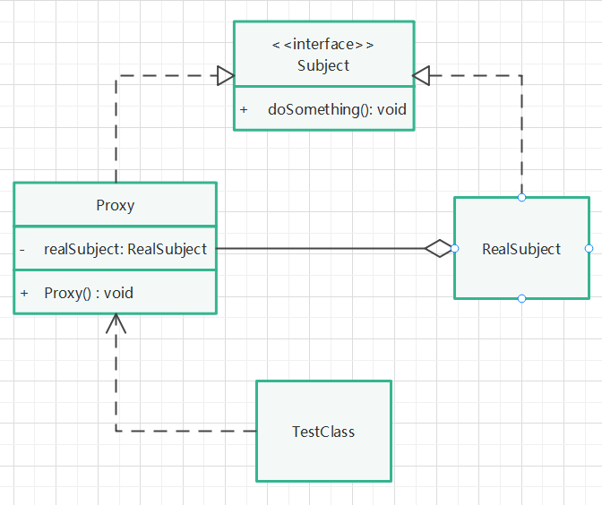

# 静态代理模式

## 实现步骤

1. 创建一个代理类和被代理类的共同接口，拥有某一方法。
2. 创建一个被代理类，实现上述接口，实现某一方法。
3. 创建一个代理类，继承被代理类，并聚合上述被代理类对象，该对象在构造函数中被初始化（非传参初始化，体现对客户端对被代理对象的不可见性）。
4. 在代理类中实现某一方法，在该方法中调用被代理类的某一方法，并在调用被代理对象方法前后，可以做一些其他操作。
5. 创建代理对象，并调用代理对象的某一方法。

## UML类图

