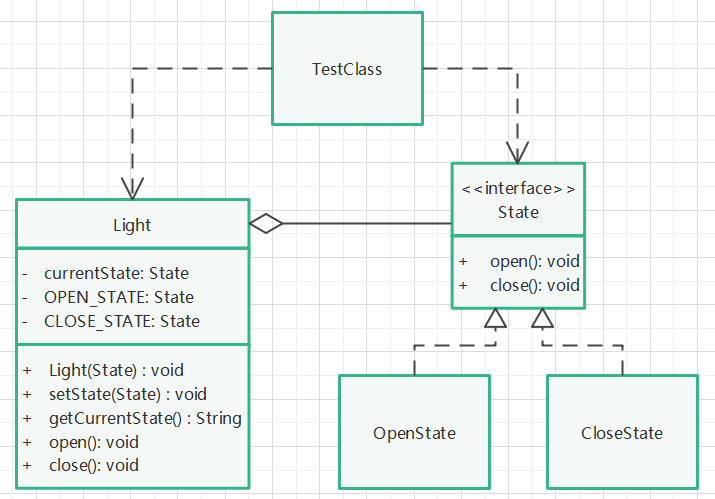

# 状态模式

## 定义

当一个对象内在状态改变时允许其改变行为，这个对象看起来像改变了其类。

## 针对问题

代码中需要有很多关于状态变化的条件判断语句，且状态的变化会引起同一操作得到不同响应，可以把状态抽象出来作为状态类，使用环境变量对状态的切换与使用进行管理。

## 实现步骤

1. 创建状态接口，提供状态的操作方法。
2. 实现状态接口，根据不同的状态，实现对同一方法调用产生不同的响应。
3. 创建环境Context类(Light)，聚合环境接口对象，提供状态操作方法、当前状态获取方法。同时可提供状态的自动切换方法。
4. 创建具体状态实现对象，创建环境对象，设置环境对象的当前状态，调用环境类提供的方法，观察输出。

## 提示

当前演示为开关灯的操作，开灯状态下不能再开灯，同理关灯状态。

## 优缺点

1. 优点：封装了状态切换规则，枚举了可能的状态，减少条件判断语句。
2. 缺点：状态类膨胀，对”开闭原则“不友好。

## UML类图

