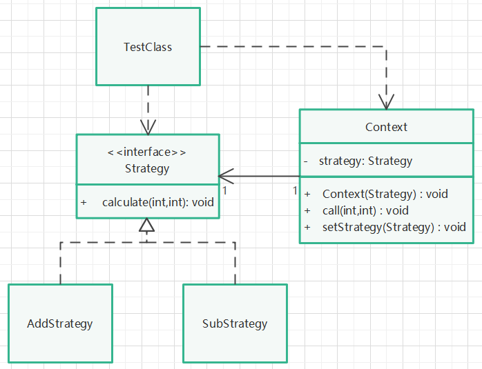

# 策略模式

## 定义

定义一组算法，将每个算法都封装起来，并且使它们之间可以互换。

## 针对问题

一个系统有很多类，这些类之间有很多相似的算法，区别仅仅是算法输出不同，如果是用条件判断语句来调用不同的类对象，那么代码将变得复杂，难以维护。因此将各种算法封装起来，提供相同的接口方法和环境变量，通过切换环境变量（或切换环境变量中的策略：环境变量提供切换策略方法），实现算法的切换。

## 实现步骤

1. 创建一个策略接口，提供算法使用方法。
2. 为策略接口创建不同的策略实现类，实现不同的算法。
3. 创建环境变量类，关联策略对象，提供策略使用方法。
4. 创建环境变量对象，调用策略使用方法。
5. 切换环境变量（或切换环境变量中的策略对象），实现策略切换。

## 优缺点

1. 优点：算法可以自由切换，避免过多的条件判断。扩展性好（面对接口的编程）。
2. 缺点：策略类数量增加。

## UML类图

