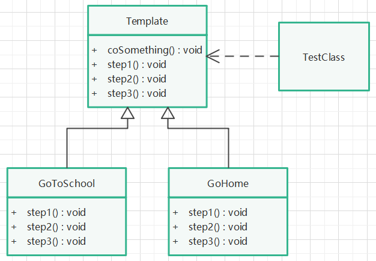

# 策略模式

## 定义

定义一个操作中算法的骨架，而将一些步骤延迟到子类中，模板方法使得子类可以不改变算法的结构即可重定义该算法的某些特定步骤。

## 针对问题

做某件事时，有一个固定的步骤，但每个步骤的细节对于不同对象都有不同的实现方法，在定义某件事时，又不可能去细化每个步骤的实现方法，只能确定需要的步骤。因此，将细化步骤的方法下放到该事件的子类中去，父类则只负责确定步骤，细节让子类去实现。

## 实现步骤

1. 创建一个事件类，定义事件步骤，确定事件执行顺序（final 子类不可修改）。
2. 为事件类创建两个子类，实现事件步骤细节。
3. 实例化事件类，调用事件对象执行方法。

## UML类图

