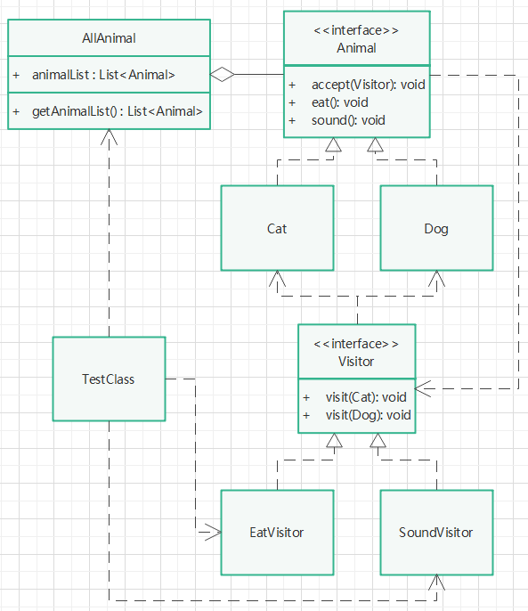

# 访问者模式

## 定义

表示一个作用于某对象结构中的各元素的操作。它使你可以在不改变各元素的类的前提下定义作用于这些元素的新操作。

## 针对问题

需要将数据的结构和数据操作分离开来的情况下。比如，有一些相对固定的数据类，提供一些基础的数据获取方法，而再其他地方，需要组合不同的数据做处理，这时，如果想不改变数据类，而是把组合不同数据的方法分离出来，这时就可以使用访问者模式。

## 实现步骤

1. 创建元素接口Animal（Element）,提供基础数据访问方法eat()、sound(),和接收访问者方法accept(Visitor)。
2. 为其创建具体元素实现类Cat、Dog（ConcreteElement），实现上述方法，其中accept方法体的 **visitor.visit(this)** 是重点。
3. 创建访问者接口（Visitor）,提供接收**特定**元素的方法，重点是特定（具体元素实现类对象）。
4. 为访问者接口创建具体实现类EatVisitor、SoundVisitor（ConcreteVisitor）,根据访问者期望实现的不同功能，实现上述visit()方法。
5. 创建结构对象，维护一个元素容器，提供获取容器内容的方法。
6. 遍历上述容器对象，通过创建不同的具体访问对象，实现不同的数据访问。

## 解析

以演示示例来看，动物类提供吃饭方法eat和叫声方法sound，访问者提供吃饭EatVisitor访问类和叫声访问类SoundVisitor,如果这时我希望动物边吃饭边发出叫声，那么我只需再创建EatAndSoundVisitor访问类，在其visit方法中调用吃饭和叫声方法即可，而不用再改变动物类所提供的方法（体现数据结构和数据操作分开变化）。

## 优缺点

1. 优点：符合单一职责原则，有一定的扩展性（解耦）。
2. 缺点：不太符合开闭原则，因为添加一种具体元素，相应的访问者也需要类也需要修改。代码复杂，逻辑复杂。

## UML类图

